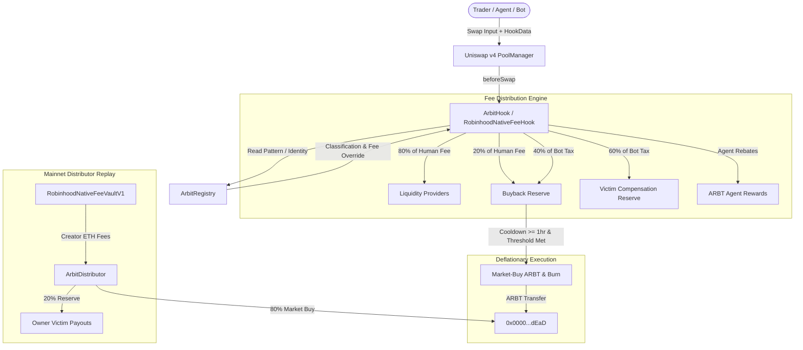

# Arbit — Uniswap v4 Dynamic-Fee Hook & Ecosystem on Robinhood Chain

> **Market limitation note (Sep 10, 2026):** The original Arbit design (`src/ArbitHook.sol:29` participant-priced fees, `ArbitRegistry.sol` classify, `ArbitBadge.sol` halving, stock `1.5x` `ArbitHook.sol:62`, per-swap buyback/victim `ArbitHook.sol:269`) cannot be packed for Programmable mainnet (4663). `capabilities.json:6-15` binds the exact kit `RobinhoodNativeFeeHookV1.sol:44` + `RobinhoodNative20Token.sol:5` + `RobinhoodNative20Initializer.sol:21`; `RobinhoodNative20Initializer.sol:87-88` forces `module==0` and `ticks 160020-200040`. Platform verification (`sourceBuild`) only covers that release tree (`0384904`, 39 files). To ship on time we launch Native20 via `pack/build.mjs:32-35` (exact kit) and retain economics off-hook via `creatorRecipient=ArbitDistributor` `RobinhoodNativeFeeVaultV1.sol:33/55`. Full hook remains on testnet/direct deploy.

Arbit is a programmable Uniswap v4 hook and decentralized application where every swap is priced dynamically by **who is trading**.

- **Human traders** pay standard fees and enjoy built-in MEV protection.
- **Registered AI agents** with strong reputation scores pay steep discounts and earn ARBT token rewards.
- **Unregistered predatory bots** pay a surcharge tax that automatically funds victim compensation and burns ARBT.
- **Tokenized stock pools** (e.g. AAPL/USDG, TSLA/USDG) receive a ⅔ fee discount and a 1.5× burn accrual subsidy.
- **Trading volume directly drives deflation**: a fixed portion of swap fees feeds an onchain buyback-and-burn engine protected by strict threshold and cooldown guards.

Live on Robinhood Chain Testnet (Chain ID 46630); launching on Robinhood Chain Mainnet (Chain ID 4663) via Programmable Custom Launch V4 (Native20 kit + distributor replay).

---

## Quick Links

- **Website / dApp:** [`website/`](./website/) (Next.js 14 + Tailwind + Ethers v6)
- **Demo Agent Simulator:** [`demo/`](./demo/) (Compliant agent vs. penalized bot)
- **Programmable Launch Pack:** [`pack/`](./pack/) (CLI configuration & standard JSON artifacts)
- **Smart Contracts:** [`src/`](./src/)
- **Comprehensive Spec & Build Guide:** [`arbit-final-build-guide.md`](./arbit-final-build-guide.md)
- **Explorer (Mainnet):** [robinhoodchain.blockscout.com](https://robinhoodchain.blockscout.com)
- **Explorer (Testnet):** [explorer.testnet.chain.robinhood.com](https://explorer.testnet.chain.robinhood.com)
- **Faucet:** [faucet.testnet.chain.robinhood.com](https://faucet.testnet.chain.robinhood.com)
- **Community / Updates:** [@arbit_hook on X](https://x.com/arbit_hook)

---

## System Architecture & Money Loop



---

## Participant Fee Schedule & Economics

Arbit transforms AMM fee routing from passive LP collection into an active economic security model:

| Participant Type | Qualification / Detection | Fee (bps) | Net Fee | Fee Asset Routing |
|---|---|---|---|---|
| **Human Trader** | Default EOA or `hookData` without high-frequency burst | **30 bps** (0.30%) | 0.30% | **80%** to LPs, **20%** to ARBT Buyback Pool |
| **Registered Agent (High Rep)** | Staked ≥100 ARBT, Rep ≥ 800 | **5 bps** (0.05%) | **0.025%** | **50%** refunded as ARBT rewards |
| **Registered Agent (Med Rep)** | Staked ≥100 ARBT, Rep 500–799 | **15 bps** (0.15%) | **0.1125%** | **25%** refunded as ARBT rewards |
| **Registered Agent (Low Rep)** | Staked ≥100 ARBT, Rep < 500 | **30 bps** (0.30%) | 0.30% | 80% to LPs, 20% to Buyback Pool |
| **Unregistered Bot** | Burst swaps (≥3 swaps in ≤10 blocks) or gas spikes | **100 bps** (1.00%) | 1.00% | **60%** to Victim Reserve, **40%** to Buyback + Burn |
| **Stock Pools** (e.g. AAPL/USDG) | Pool flagged via `setStockPool` | **⅔ base fee** | 20 / 10 / 3.3 bps | **1.5× burn accrual** (subsidized burn pressure) |
| **Badge Holders** | Holds ERC-721 `ArbitBadge` | **50% discount** | Halved base fee | One `balanceOf` check in `beforeSwap` |

### Buyback Guard Specifications
- **Cooldown:** `BUYBACK_COOLDOWN = 1 hours` between automated buybacks.
- **Threshold:** Must exceed `MIN_BUYBACK_AMOUNT` (0.05 ARBT on testnet / 0.005 ETH on Distributor).
- **Solvency Invariant:** All pending rewards and buyback commitments are hard-capped by the contract's real token balances. Zero synthetic debt can be printed; shortfalls revert.

---

## Contracts Overview (`src/`)

| Contract | Role & Functionality | Mainnet (4663) Status |
|---|---|---|
| [`ArbitToken.sol`](./src/ArbitToken.sol) | Fixed 1,000,000,000 ARBT supply ERC-20 with no minting, pausing, or owner backdoor. Pack graph `token` target. | **Replaced by** `RobinhoodNative20Token.sol:5` (verified kit) |
| [`ArbitRegistry.sol`](./src/ArbitRegistry.sol) | Tracks agent registrations, stake collateral, reputation scores (0–1000), bot frequency/gas heuristics, and pool allowlists. | **Off-hook** — deployed standalone post-launch (`RobinhoodNative20Initializer.sol:88` restricts in-launch hook calls). |
| [`ArbitHook.sol`](./src/ArbitHook.sol) | Full Uniswap v4 dynamic-fee hook: single-classify cache, fee split routing, Buyback Guard, stock-pool 1.5× subsidy, and badge discounts. | **Replaced by** `RobinhoodNativeFeeHookV1.sol:44` (flat `20 bps + creatorBps`, `module==0`). Full hook operates on testnet and direct deploys. |
| [`ArbitDistributor.sol`](./src/ArbitDistributor.sol) | Creator-fee sidecar: claims accrued creator revenue from the fee vault, runs Guard-gated market-buy & burn (80%), and maintains victim reserve (20%). | **Kept** as `creatorRecipient` on `RobinhoodNativeFeeHookV1.sol:78` → `RobinhoodNativeFeeVaultV1.sol:55` ETH buyback & victim replay. |
| [`ArbitBadge.sol`](./src/ArbitBadge.sol) | ERC-721 achievement passes (Bronze/Silver/Gold) reflecting agent reputation. Holding any badge halves swap fees in `ArbitHook`. | **Off-hook** — mintable post-launch; holder discount active on direct hook deployments. |
| [`ArbitAgentExecutor.sol`](./src/ArbitAgentExecutor.sol) | Smart-contract execution wrapper enabling autonomous agents to hold onchain identity, execute swaps, and register cleanly. | **Off-hook** tool for agent infrastructure. |
| [`ArbitFeeModule.sol`](./src/ArbitFeeModule.sol) | View-only dynamic-fee module for `RobinhoodNativeFeeHookV1`: maps registry tiers to capped LP fee overrides with zero deltas. | **Disabled** — initializer enforces `module == address(0)`. |
| [`ArbitInitializer.sol`](./src/ArbitInitializer.sol) | Atomic launch contract: wires registry, initializes pool, seeds permanently locked LP, and executes first buy in a single transaction. | **Replaced by** `RobinhoodNative20Initializer.sol:21` (enforcing ticks `160020-200040`). |

---

## Web Application (`website/`)

Arbit features a production-ready Web3 frontend built with **Next.js 14**, **React 18**, **Tailwind CSS**, and **Ethers v6**.

### Key UI Features
1. **Interactive Aceternity Hero:** Dynamic background ripple grid effect with responsive cursor ripples and floating pixel badges.
2. **"Launched On" Proof Strip:** Verified launch badge on Robinhood Chain and Programmable Market.
3. **"How Arbit Works" Overview:** Clean visual breakdown of normal trading vs. protocol incentives.
4. **"What's in the Bag" 3D Carousel:** 6 interactive cards covering Traders, MEV Protection, Autonomous Agents, Liquidity Providers, Stock Pools, and Buyback/Burns.
5. **3 Identity-Based Trading Lanes:** Interactive cards displaying live rates, routing breakdowns, and expandable technical details for Humans, Registered Agents, and Bots.
6. **Interactive Fee & Routing Simulator:** Real-time calculator modeling fee breakdowns and net rates across all 3 tiers for any custom trade volume.
7. **Live Onchain Hook Telemetry:**
   - Real-time balances for Buyback Pool, Victim Compensation Reserve, and Total ARBT Burned (`0xdead`).
   - Active countdown timer tracking the 1-hour Buyback Guard cooldown.
   - Live RPC fetch with fallback states to prevent UI hangs.
8. **Agent Terminal:**
   - One-click Web3 wallet connection and network detection.
   - Stake 100 ARBT to register an onchain agent identity.
   - View live reputation scores, active fee tier, and pending token rewards.
   - Claim ARBT cash-back rewards and mint Bronze/Silver/Gold achievement badges.
9. **Capped-by-Code Immutability Table:** Transparent disclosure of all onchain fee caps and immutables.
10. **Expandable FAQ & Developer Documentation:** Complete answers to common trader, LP, agent, and security questions.

### Running the Web App Locally
```bash
cd website
npm install
npm run dev
# Open http://localhost:3000 in your browser
```

Configuration is handled via `website/.env.local`:
```env
NEXT_PUBLIC_RPC_URL=https://rpc.mainnet.chain.robinhood.com
NEXT_PUBLIC_HOOK_ADDRESS=0xb099980588E1458D678E5bdfe048A37f910A40C0
NEXT_PUBLIC_REGISTRY_ADDRESS=0x07f0118fe19c003D7AE90C7D43b4d1D3985eCa9b
NEXT_PUBLIC_ARBT_ADDRESS=0xd2cAA129a525D65684C112b074425E8d85a71533
NEXT_PUBLIC_POOL_MANAGER_ADDRESS=0x38d13B77728c357652313AA0a6fc97229F44CD8E
```

---

## Demo Agents Suite (`demo/`)

The repository includes runnable Node.js agent scripts (using Ethers v6) that demonstrate onchain interactions against Robinhood Chain:

- **Good Agent ([`good-agent.js`](./demo/good-agent.js)):**
  1. Deploys an `ArbitAgentExecutor`.
  2. Approves and stakes 100 ARBT into `ArbitRegistry`.
  3. Executes an authorized, low-fee swap benefiting from the agent rebate.
- **Bad Agent ([`bad-agent.js`](./demo/bad-agent.js)):**
  1. Executes rapid burst swaps or excessive gas transactions.
  2. Gets flagged by the registry pattern tracker.
  3. Charged the 1.00% bot penalty fee; subsequent abusive calls are penalized and slashed.

### Running Demo Agents
```bash
cd demo
npm install

# Set environment variables (see demo/README.md)
export PRIVATE_KEY=0x...
export RPC_URL=https://rpc.mainnet.chain.robinhood.com
export ARBT_ADDRESS=0x...
export REGISTRY_ADDRESS=0x...
export HOOK_ADDRESS=0x...
export POOL_MANAGER_ADDRESS=0x...
export POOL_KEY_JSON='{"currency0":"0x...","currency1":"0x...","fee":8388608,"tickSpacing":10,"hooks":"0x..."}'

# Run good agent
npm run good

# Run bad agent
npm run bad
```

---

## Test Suite & Verification

The smart contracts are thoroughly verified using Foundry:

```bash
# Build contracts with solc 0.8.26
forge build

# Run unit, fuzz, and invariant test suite (60 passed, 4 fork tests skipped by default)
forge test

# Run full fork tests on Robinhood Chain Mainnet / Testnet
RUN_FORK_TESTS=1 forge test --match-contract 'KernelTest|MoneyLoopTest|ForkMainnetTest|TestnetDebugTest'
```

### Coverage Highlights
- **Fee Routing:** Human, Agent High/Med/Low, and Bot fee calculations across both swap directions (`zeroForOne = true/false`).
- **Identity Attribution:** HookData trader decoding with fallback to `sender`.
- **Cache Integrity:** Single-classify cache populated in `beforeSwap` and cleared in `afterSwap`.
- **Buyback Guard:** Cooldown timer enforcement, threshold checks, and flash loan manipulation resistance.
- **Stock Multipliers:** Precise ⅔ fee reduction and 1.5× burn accrual ratio checks.
- **Badges:** Minting permissions, duplicate prevention, and 50% fee discount verification.
- **Invariants:** `previewFee` never exceeds `MAX_FEE_BPS` (fuzzed 256 runs); pool reserves never negative and all promises backed.

---

## Security Guardrails & Audit Summary

Based on real-world AMM exploits and comprehensive static analysis:

| Vulnerability Vector | Defense Implemented in Arbit |
|---|---|
| **Unauthorized Callbacks (Cork exploit)** | `onlyPoolManager` modifier on all Uniswap v4 callback endpoints. |
| **State Reentrancy** | `nonReentrant` on hook and all state-modifying registry functions; strict Checks-Effects-Interactions (CEI). |
| **Cross-Pool Contamination** | Explicit `allowedPools` allowlist verified via `key.toId()` in `beforeSwap`. |
| **Permission Mismatch** | Constructor validates declared hook permissions against hook address bitmask via `Hooks.validateHookPermissions()`. |
| **Settlement Accounting Bugs** | Zero return deltas (`BeforeSwapDeltaLibrary.ZERO_DELTA`, `0` custom delta). Value moves purely via ERC-20/SafeERC20. |
| **Gas Griefing / Denial of Service** | $O(1)$ complexity in `beforeSwap` and `afterSwap` (no loops, cached reads). Pattern math uses division to prevent multiplication overflow. |
| **Shared Router Address Collision** | Swapper address decoded from 32-byte `hookData` (with fallback to `sender`), preventing router address conflation. |
| **Unbacked Promises** | `totalPromised` accumulator ensures promised rewards, victim payouts, and burns never exceed real token balances held. |

### Slither Static Analysis Report (102 Detectors)
- **0 High / Medium vulnerabilities** on codebase contracts.
- **Documented Lows / Design Decisions:**
  - L2 `tx.gasprice` signal latency and 3-swap warmup window (victim fund provides recovery).
  - Manual owner distribution of victim funds pending decentralized governance.
  - Keeper-gated buyback execution (TWAP oracle integration slated post-hackathon).

---

## Deployments & Network Details

### Robinhood Chain Testnet (Chain ID `46630`) — Live & Confirmed
- **RPC:** `https://rpc.testnet.chain.robinhood.com`
- **Explorer:** `https://explorer.testnet.chain.robinhood.com`
- **Faucet:** `https://faucet.testnet.chain.robinhood.com`

| Contract | Address |
|---|---|
| Mock ARBT Token | `0xd2cAA129a525D65684C112b074425E8d85a71533` |
| Canonical PoolManager | `0x38d13B77728c357652313AA0a6fc97229F44CD8E` |
| ArbitRegistry | `0x07f0118fe19c003D7AE90C7D43b4d1D3985eCa9b` |
| ArbitHook | `0xb099980588E1458D678E5bdfe048A37f910A40C0` |

### Local Dry-Run (Anvil)
```bash
# Terminal 1: Start local node
anvil

# Terminal 2: Deploy and configure local contracts
forge script script/SetupAnvil.s.sol --broadcast --rpc-url http://127.0.0.1:8545 --unlocked --sender <anvil-acct>
forge script script/DeployArbit.s.sol --broadcast --rpc-url http://127.0.0.1:8545 --unlocked --sender <anvil-acct>
```

### Robinhood Chain Mainnet via Programmable (Chain ID `4663`)
- **Canonical PoolManager:** `0x8366a39CC670B4001A1121B8F6A443A643e40951`
- **Programmable Launch CLI (v4.1.0):**

```bash
# 1. Compile vendor kit and pack workspace
npm run build --prefix pack

# 2. Generate launch plan
programmable-launch pack --config pack/programmable-launch.config.json --output pack/launch.json

# 3. Validate remotely (preflight dry-run)
programmable-launch validate pack/launch.json --config pack/programmable-launch.config.json --remote

# 4. Submit durable launch request
programmable-launch submit pack/launch.json --config pack/programmable-launch.config.json

# 5. Monitor until authorized for signing
programmable-launch status <LAUNCH_ID> --api-version 4 --chain-id 4663 --watch --until authorized

# Controller reviews and signs transaction, then:
programmable-launch status <LAUNCH_ID> --api-version 4 --chain-id 4663 --watch --until finalized
```

---

## Key Architectural Decisions (Why)

1. **Hook Does No Settlement Math:** By returning `BeforeSwapDeltaLibrary.ZERO_DELTA` and zero custom deltas, the hook eliminates pool accounting desynchronization and reentrancy vectors by construction.
2. **Classify Once, Cache, and Clear:** Classification occurs exactly once in `beforeSwap`, is stored in transient contract storage, reused in `afterSwap`, and immediately purged. Double-classification is impossible.
3. **`sender` ≠ Trader:** Shared aggregation routers collapse all EOAs to one contract address. Arbit reads actual user identity from 32-byte `hookData`, falling back to `sender` for direct pool callers or `ArbitAgentExecutor` instances.
4. **Atomic In-Launch Wiring:** The deploying EOA cannot execute administrative transactions during an atomic factory launch. `setHook` and `allowPool` are authorized for the `ArbitInitializer` contract.
5. **Permanently Locked Seed Liquidity:** Removing LP withdrawal paths eliminates a major custody and rug-pull risk.
6. **Hard Balance Backing:** Agent rewards, victim distributions, and token burns are bounded by actual contract asset holdings (`totalPromised`).

---

## License

This project is licensed under the MIT License. See individual contract headers for SPDX identifiers.
